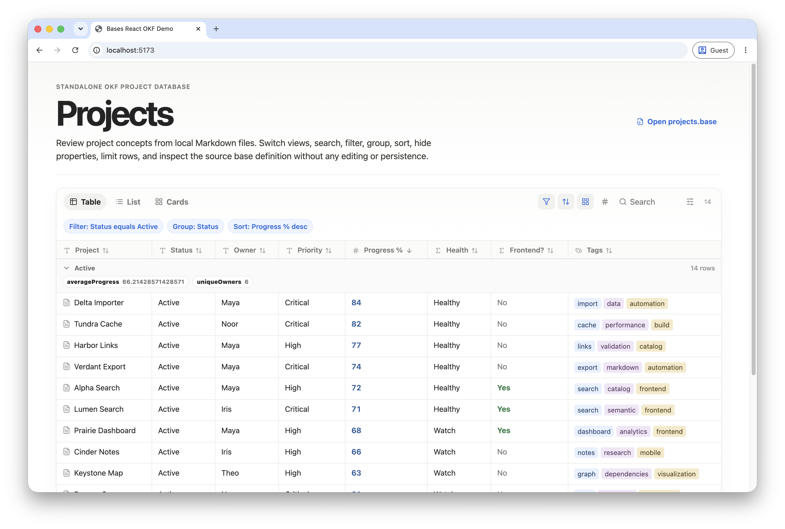

# Obsidian Bases React

A standalone React package suite for rendering Obsidian Bases-style views from `.base` YAML and normalized Markdown/vault file data.

The alpha focuses on standalone React usage: parse `.base` files, normalize definitions, load Markdown frontmatter, evaluate rows/columns/filters/formulas/summaries, and render table/list/cards views in a Vite demo.

## Live demo

**Try the interactive demo:** <https://tavon-ai.github.io/bases-react/>



## Packages

- `@bases-react/core` — parser, schema normalization, expression evaluation, filters, formulas, sorting, and summaries.
- `@bases-react/fs` — Markdown/frontmatter adapter for standalone demos and tests.
- `@bases-react/tanstack` — TanStack Table column adapter.
- `@bases-react/react` — React components, value renderers, toolbar, and view renderers.

## Try the demo

```bash
pnpm install
pnpm dev:demo
```

Then open the Vite URL and review the Projects views rendered from local Markdown files.

## Manual GitHub Pages deployment

The demo can be deployed manually to a `gh-pages` branch without GitHub Actions:

```bash
pnpm deploy:demo
```

This builds the workspace packages, builds `examples/simple-react-app`, and publishes `examples/simple-react-app/dist` with `gh-pages`. In GitHub, configure Pages to deploy from the `gh-pages` branch root.

The demo Vite config uses `base: './'`, so the built app works from a GitHub Pages subpath such as `https://USER.github.io/REPO/`.

## Minimal usage

```tsx
import '@bases-react/react/styles.css'
import { BaseView } from '@bases-react/react'
import { loadMarkdownFiles, parseBaseFile } from '@bases-react/fs'
import baseYaml from './projects.base?raw'

const files = loadMarkdownFiles(import.meta.glob('./projects/*.md', { as: 'raw', eager: true }))
const base = parseBaseFile(baseYaml)

export function App() {
  return <BaseView base={base} files={files} view="Projects" />
}
```

## Documentation

- [Getting started](docs/getting-started.md)
- [Core API](docs/core-api.md)
- [React API](docs/react.md)
- [Data adapters](docs/data-adapters.md)
- [Supported syntax](docs/syntax.md)
- [Compatibility](docs/compatibility.md)
- [Limitations](docs/limitations.md)
- [Roadmap](docs/roadmap.md)
- [Release checklist](docs/release.md)

## Current limitations

This is a compatibility subset, not a full Obsidian implementation. Editing, map rendering, advanced card image handling, and the Obsidian bridge are deferred.
